# Hospitality Manager - Sistema de Gestión de Pedidos y Stock

[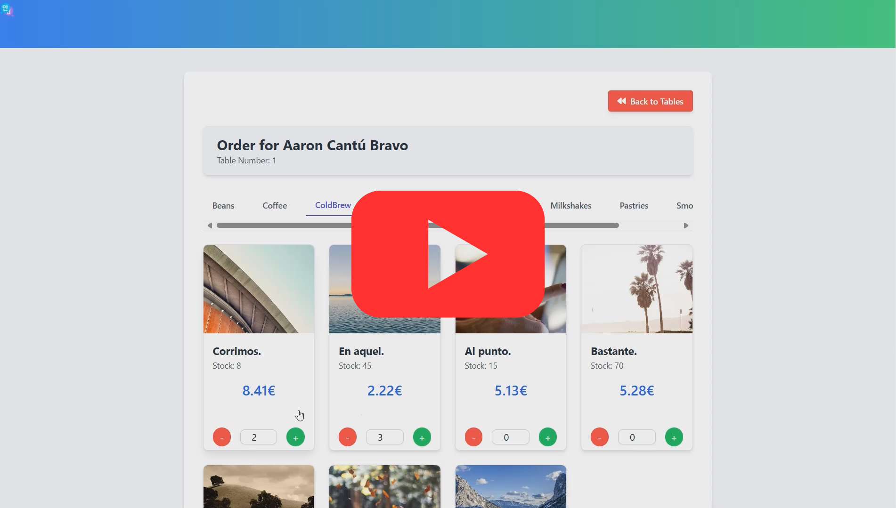](https://youtu.be/cXtceCzayG4)

> **Mira el video de demostración:** Haz clic en la imagen para ver un recorrido del sistema en acción.

## 📌 Descripción

Hospitality Manager es un sistema desarrollado en **Laravel** para gestionar pedidos, productos, mesas y usuarios en un entorno de restaurante o negocio similar. El proyecto maneja la lógica de stock de productos, asignación de pedidos a mesas y usuarios, y permite la administración de categorías y productos.

## 🚀 Tecnologías utilizadas

- **Backend**: Laravel 11
- **Base de datos**: MySQL / SQLite (para pruebas)
- **Frontend**: Blade + Tailwind
- **ORM**: Eloquent
- **Control de Versiones**: Git y GitHub

## 📂 Estructura del proyecto

```bash
app/
 ├── Http/
 │    ├── Controllers/
 │    │    ├── CategoryController.php
 │    │    ├── OrderController.php
 │    │    ├── ProductController.php
 │    │    ├── TableController.php
 │    │    ├── UserController.php
 │    ├── Requests/
 │    │    ├── CategoryRequest.php
 │    │    ├── OrderRequest.php
 │    │    ├── ProductRequest.php
 │    │    ├── TableRequest.php
 │    │    ├── UserRequest.php
 ├── Models/
 │    ├── Category.php
 │    ├── Order.php
 │    ├── Product.php
 │    ├── Table.php
 │    ├── User.php
 ├── Services/
 │    ├── OrderService.php
 │    ├── TableService.php
 ├── database/
 │    ├── migrations/
 │    ├── factories/
 │    ├── seeders/
```

## 📌 Características principales

✅ **Gestión de pedidos**: Creación, actualización y eliminación de pedidos con productos asociados.

✅ **Control de stock**: Validaciones para evitar stock negativo y actualización automática tras cada pedido.

✅ **Sistema de usuarios**: Administración de clientes y empleados con diferentes roles.

✅ **Gestión de productos y categorías**: CRUD de productos y categorización.

✅ **Manejo de mesas**: Asignación de pedidos a mesas específicas.

✅ **Componentes reutilizables**: Uso de `Blade Components` para mejorar la estructura del frontend.

✅ **Soporte para imágenes**: Manejo de imágenes para productos y usuarios.

## 🛠 Instalación y configuración

### **1. Clonar el repositorio**

```sh
git clone https://github.com/Omatple/Hospitality-Manager.git
cd Hospitality-Manager
```

### **2. Instalar dependencias**

```sh
composer install
```

### **3. Configurar el entorno**

```sh
cp .env.example .env
php artisan key:generate
```

### **4. Ejecutar migraciones y seeders**

```sh
php artisan migrate --seed
```

### **5. Levantar el servidor**

```sh
php artisan serve
```

## 📌 Rutas principales

### **🏠 Página principal**

- `GET /` → Página de inicio

### **🛒 Gestión de pedidos (Orders)**

- `GET /orders` → Listar pedidos
- `POST /orders` → Crear un nuevo pedido
- `GET /orders/{order}` → Ver detalles de un pedido
- `PUT /orders/{order}` → Actualizar un pedido
- `DELETE /orders/{order}` → Eliminar un pedido
- `GET /orders/create/table/{table}/select-user` → Seleccionar usuario para una orden
- `GET /orders/create/table/{table}/select-user/{user}/select-products` → Seleccionar productos para una orden

### **📦 Gestión de productos (Products)**

- `GET /products/category/{category_id?}` → Listar productos por categoría
- `POST /products` → Crear un nuevo producto
- `GET /products/{product}` → Ver detalles de un producto
- `PUT /products/{product}` → Actualizar un producto
- `DELETE /products/{product}` → Eliminar un producto

### **🏷️ Gestión de categorías (Categories)**

- `GET /categories` → Listar categorías
- `POST /categories` → Crear una categoría
- `PUT /categories/{category}` → Actualizar una categoría
- `DELETE /categories/{category}` → Eliminar una categoría

### **🪑 Gestión de mesas (Tables)**

- `GET /tables` → Listar mesas
- `POST /tables` → Crear una nueva mesa
- `PUT /tables/{table}` → Actualizar una mesa
- `DELETE /tables/{table}` → Eliminar una mesa

### **👥 Gestión de usuarios (Users)**

- `GET /users` → Listar usuarios
- `POST /users` → Crear un nuevo usuario
- `PUT /users/{user}` → Actualizar un usuario
- `DELETE /users/{user}` → Eliminar un usuario

## 📌 Gestión de stock en pedidos

El sistema maneja el stock de los productos de manera automática al crear, actualizar y eliminar pedidos. Se aplican las siguientes reglas:

- **Al crear un pedido**: Se verifica la disponibilidad de stock para cada producto antes de asignarlo al pedido. Si un producto no tiene suficiente stock, se rechaza la orden o se ajusta la cantidad.
- **Al actualizar un pedido**: Si la cantidad de un producto cambia, el stock se ajusta en consecuencia. Si se reduce la cantidad de un producto en un pedido, el stock se incrementa nuevamente.
- **Protección contra stock negativo**: Se implementan validaciones para garantizar que el stock nunca sea menor que 0.

## 📸 Capturas de pantalla

### 🏠 Pantalla de inicio

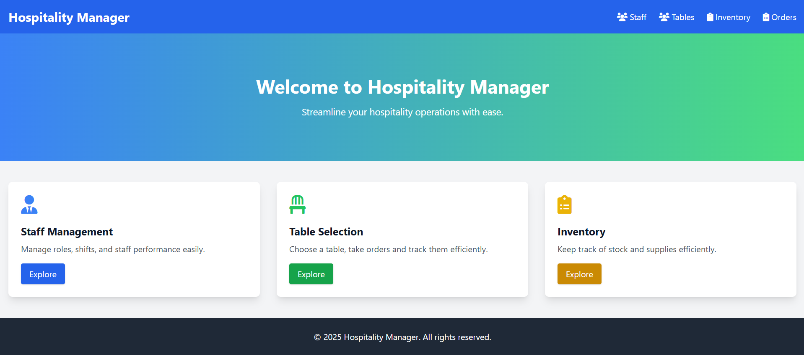

### 📋 Gestión de mesas

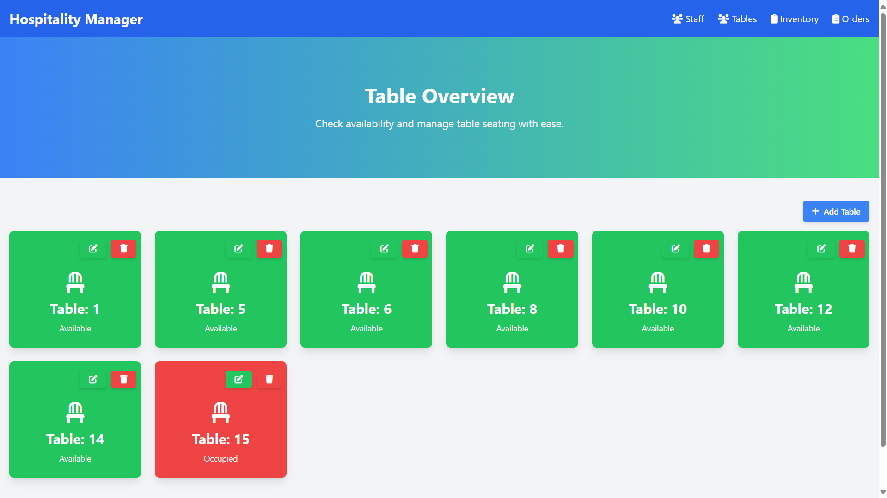

### 🗂 Gestión de categorías

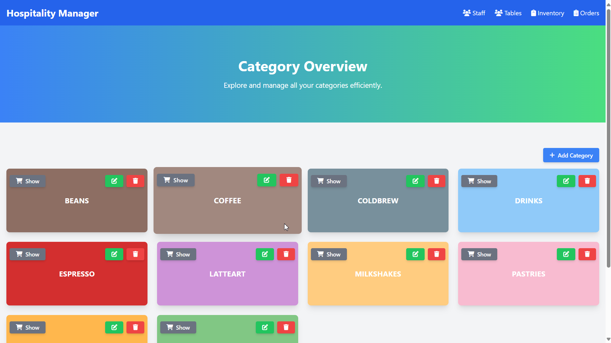

### 📦 Gestión de inventario

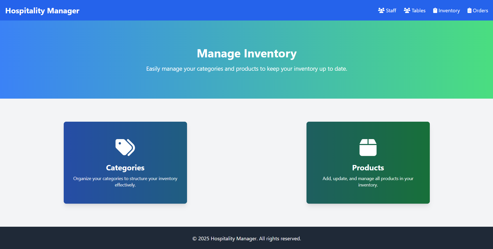

### 👥 Gestión de usuarios

#### 📌 Listado de usuarios

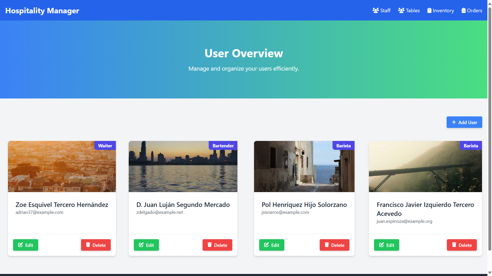

#### ➕ Crear usuario

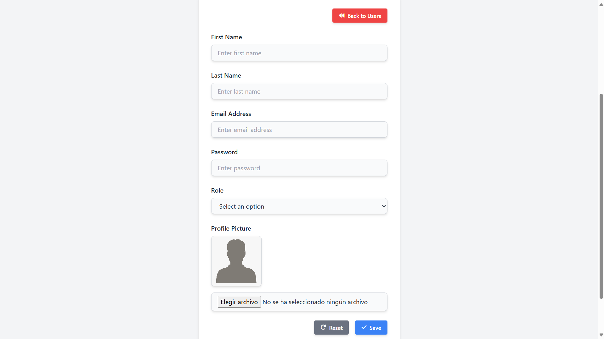

#### ✏️ Editar usuario

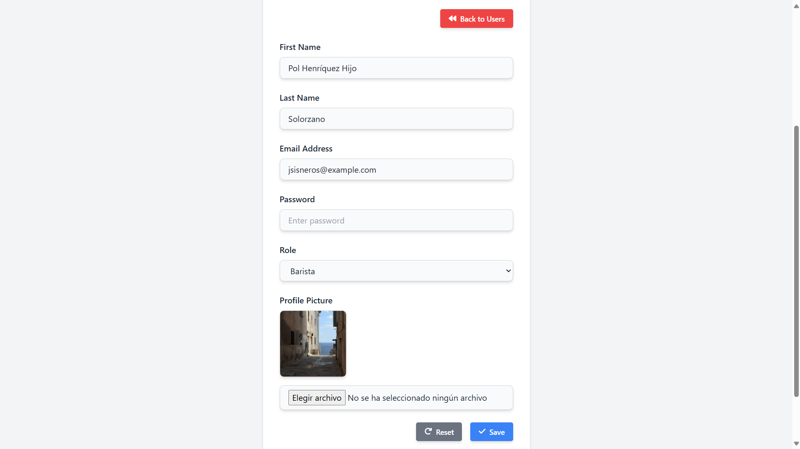

### 📝 Gestión de órdenes

#### 📋 Selección de mesa para órdenes


#### 🏷 Selección de usuario para órdenes

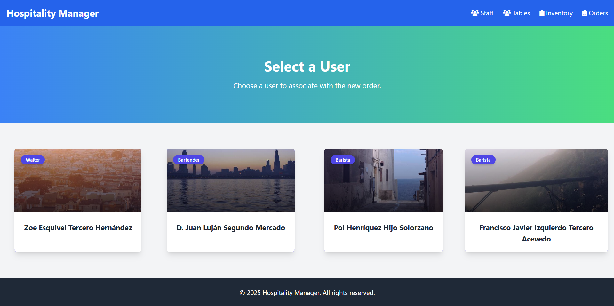

#### 🛒 Selección de productos para la orden

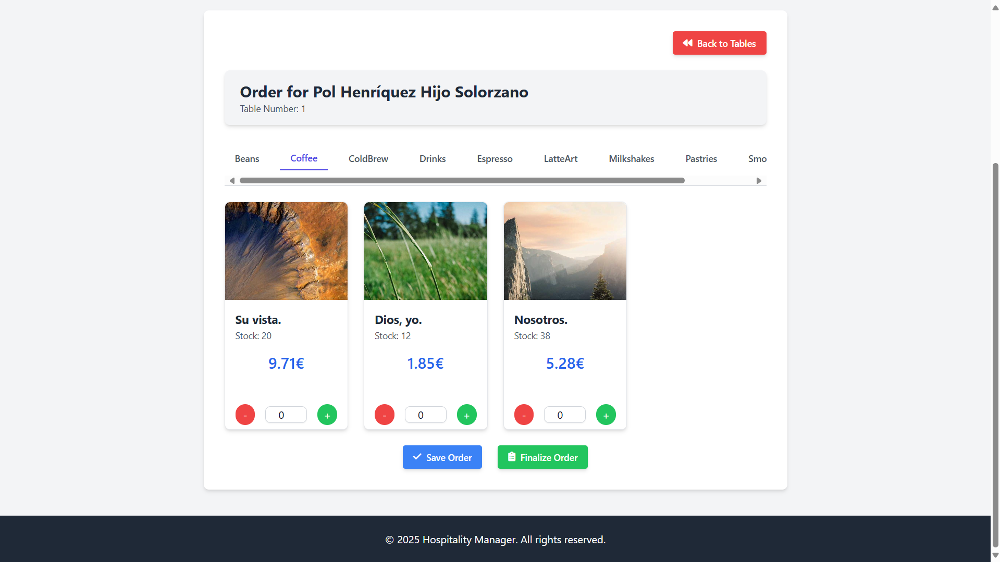

#### 📃 Vista de órdenes

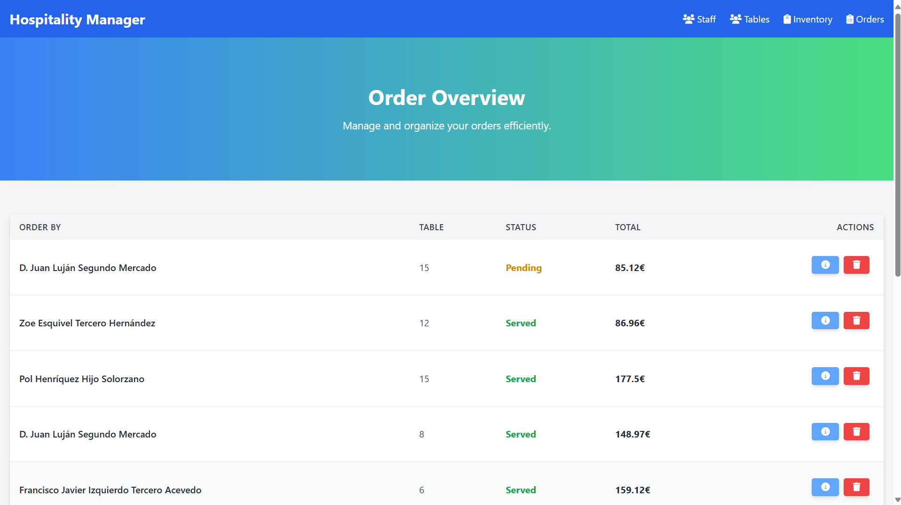

#### 🧾 Detalle de una orden

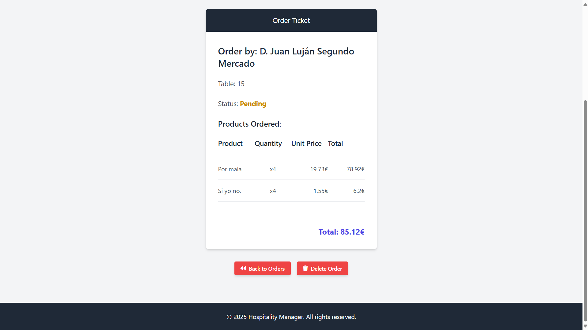

### 🛍 Gestión de productos

#### ➕ Crear producto

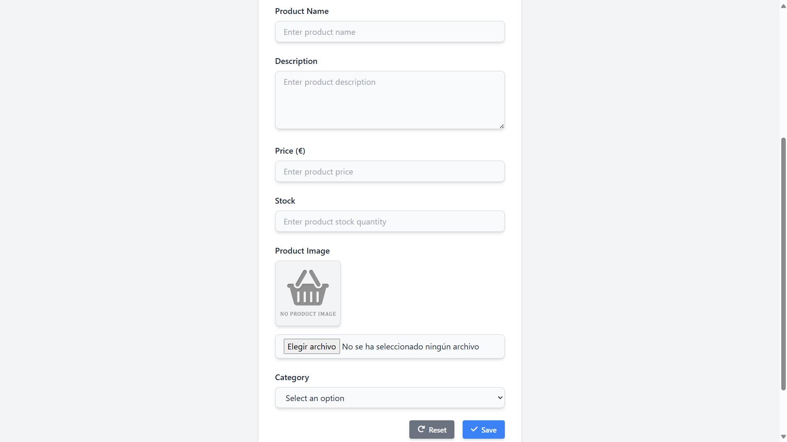

#### ✏️ Editar producto

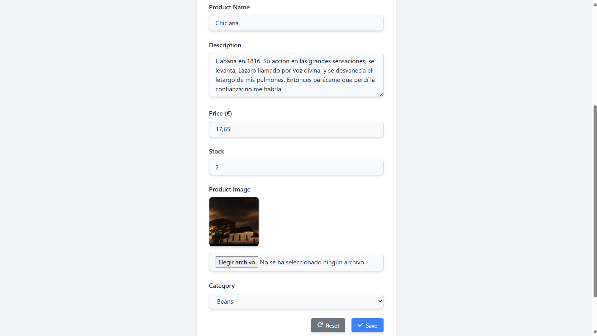

#### 📃 Listado de productos

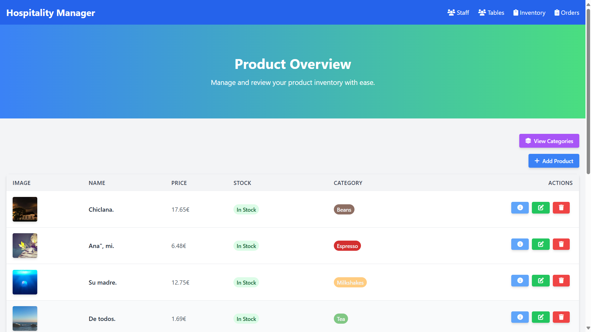

#### ℹ️ Detalle de un producto

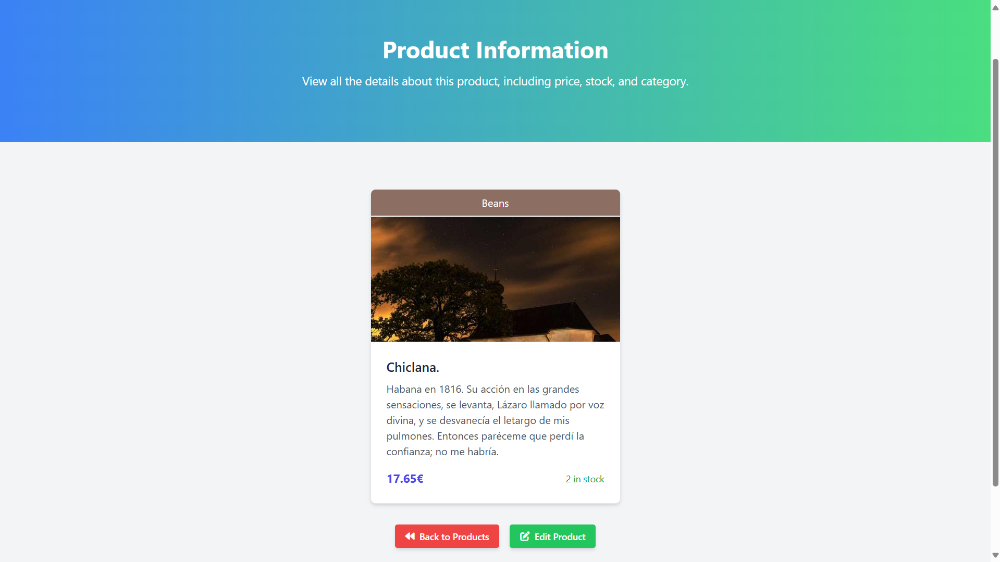

### 🔔 Mensajes de alerta

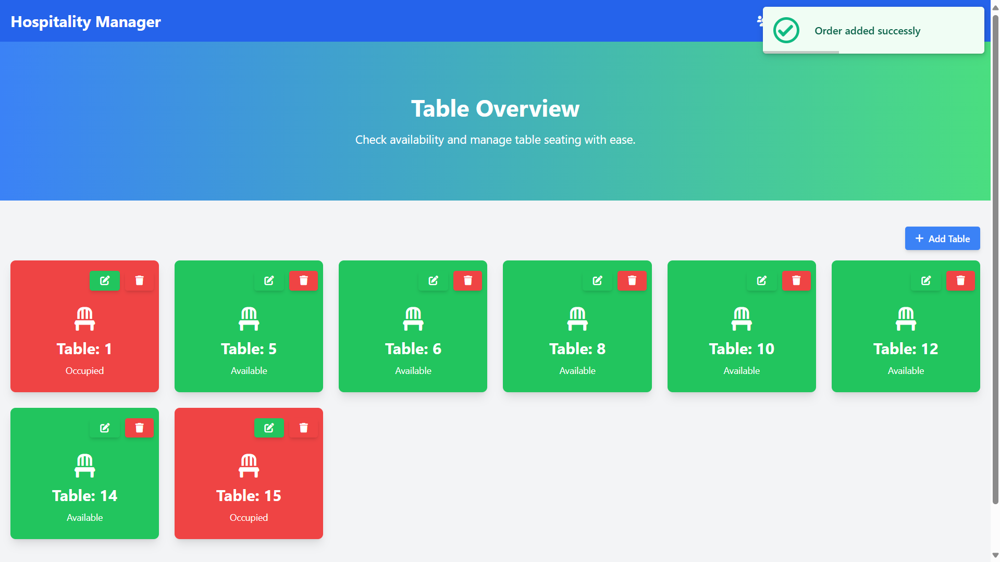

## 📌 Créditos

- **Desarrollador**: Ángel Martínez Otero
- **Repositorio**: [GitHub](https://github.com/Omatple/Hospitality-Manager)

## 📌 Licencia

Este proyecto está bajo la licencia [Licencia MIT](LICENSE.txt). Puedes usarlo y modificarlo libremente.
